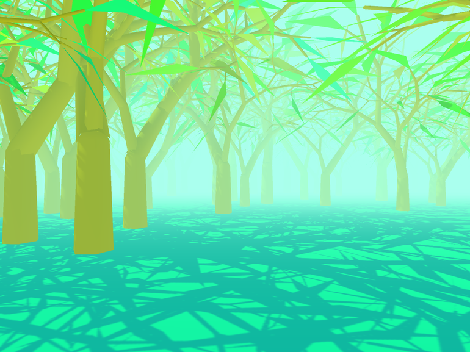

A Study in Composition
====

Video: [Link](https://www.youtube.com/watch?v=CaG1dn8Og9M)

> "Procedurally generated trees, landscapes and color palettes form striking visuals together with evocative soundscapes. There's no interaction here, so just turn up the volume, sit back and be hypnotized."

This repository is a Unity project to be used with the Unity game engine, version 5.2 or later.

Background and technique
---

This interactive experience was a study in how to create varied landscapes evoking many different moods using only simple means. Each scene consists of just a flat plane and a distribution of trees, all of it with simple colors without textures. Additionally there is a light source, variable fog amount, and sometimes a star-field.

The trees are procedurally generated using L-systems and are distributed in many different ways using multiple noise functions.

An important element of evoking different moods despite the simple means is in the color selection. A palette is created by choosing an initial color and creating either a pair of complementary colors from it, or a color triad. The initial color determines the saturation and value (brightness) of all of them. Some extra color variations are created, and each scene element is then assigned a color from this palette. Each scene element knows its "normal" color and will attempt to choose a color from the palette similar to that. This will often result in natural landscapes with green grass, blue sky, brown branches, and green to red leaves. Sometimes though, nothing close to those colors will be available in the palette, and the result may be more surrealistic.

Contributions
---

Geometry & Wind by Morten Nobel-Jørgensen (@mortennobel)  
Composition & Colors by Rune Skovbo Johansen (@runevision)  
Soundscape & Music by Andreas Frostholm  

License
---

This project is licensed under the MIT license. See the readme.md file for details.
